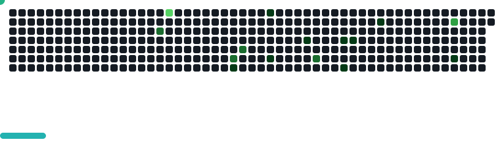

# Hey there! 👋 I'm Stektikegh

  
  
  
  
  

## 🚀 About Me

I'm a passionate developer who likes to explore the intersection of technology and creativity. From web development to AI projects and game development, I enjoy solving diverse challenges and bringing ideas to life.

- 🌱 Always learning new technologies
- 🎮 Game development enthusiast
-  Vim guy

## 🛠️ Tech Stack

### Languages

### Frameworks & Tools

## 💼 [Portfolio](https://github.com/Stektikegh/Portfolio)
My personal portfolio website showcasing projects and skills.
- **Tech Stack:** HTML, CSS, JavaScript
- **Features:** Project showcase, responsive design, interactive elements

## 📊 GitHub Stats

  
  
  
  
  
  

## 🎯 Current Focus

- 🔧 Building web apps with Next.js
- 🤖 Exploring advanced AI and machine learning techniques
- 🎮 Developing games with Godot

  
  **"Code is poetry written in logic"** ✨
  
  
  

